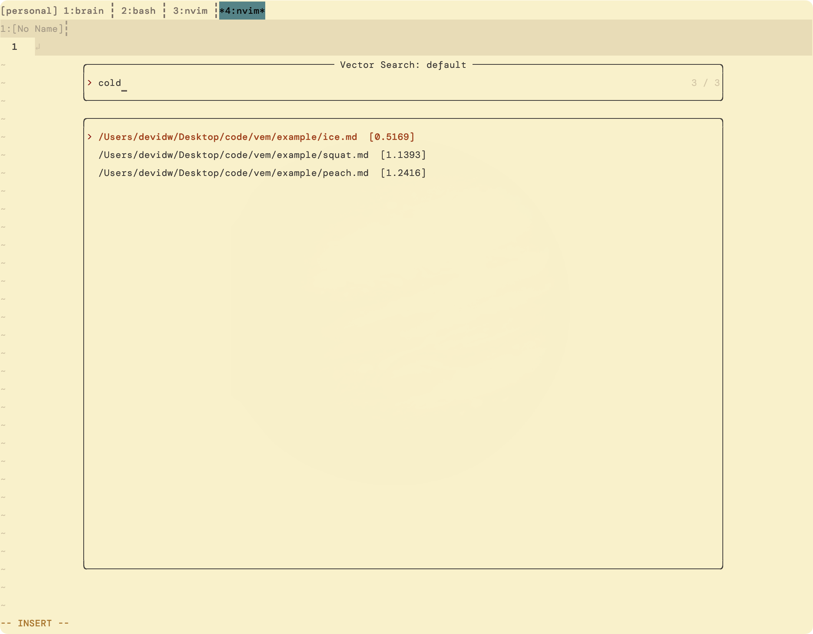

# vem

*v*im + s*em*antic search

runs a local vec db and embedding model and watches configured directories of your fs to reindex on change and provides an api for semantic search + telescope frontend



## setup

-   chromadb
    ```
    python -m venv venv
    source ./venv/bin/activate
    pip install -r ./requirements.txt
    ```
-   lm studio

    -   download an embedding model, eg `text-embedding-nomic-embed-text-v1.5-embedding` (./emb.ts)
    -   run headless https://lmstudio.ai/docs/app/api/headless

-   node project
    ```
    pnpm install
    ```

## nvim

with lazy.vim

```lua
{
    "vem",
    dir = "/users/devidw/desktop/code/vem",
    dependencies = {
        'nvim-telescope/telescope.nvim',
    },
    config = function()
        require("telescope").load_extension("vem")

        vim.keymap.set("n", "<leader>v", function()
            require("telescope").extensions.vem.search({
                repo_path = "/Users/devidw/Desktop/code/vem",
                config_path = "/Users/devidw/Desktop/code/vem/config.json",
            })
        end)
    end
},
```

## run

see ./config.ts

```
pnpm dev ./path/to/my/config.json
```

-   starts the vec db
-   maybe loads the emb model
-   reindex all collections
-   start fs watchers to re-embed

---

-   [x] run chromadb
-   [x] run some embedding model
-   [x] watch folder and index into db
-   [x] api to query
-   [x] telescope plugin
